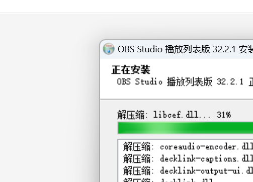

# OBS Studio 播放列表版使用说明

适用版本：OBS Studio 32.2.1 + Media Playlist Source 0.1.3  
适用系统：Windows 10/11 x64

## 1. 下载与安装

1. 打开项目的 [Releases 页面](https://github.com/chivukulalaydee-alt/OBS-/releases/latest)。
2. 下载 `OBS-Studio-32.2.1-Playlist-Edition-Setup.exe`。
3. 关闭正在运行的 OBS Studio。安装器检测到 `obs64.exe` 时会停止安装，防止覆盖正在使用的文件。
4. 双击安装器，阅读许可说明并选择安装目录。
5. 安装完成后，通过桌面或开始菜单中的“OBS Studio 播放列表版”启动。

安装器当前没有商业代码签名。Windows 显示“未知发布者”或 SmartScreen 提示时，请先确认文件来自本仓库，并核对 SHA-256；确认无误后再选择“更多信息”与“仍要运行”。

正式安装器 SHA-256：

```text
1A84A6528DF195CD150F58C20EBA063CD7194379596D5FDE45AE27A1F929E825
```



## 2. 第一次启动

本版本使用 OBS 官方用户配置目录 `%APPDATA%\obs-studio`。如果电脑上已经使用过官方 OBS，原有场景、配置和日志可能会继续显示。

建议：

- 不要同时运行官方 OBS 和“OBS Studio 播放列表版”。
- 首次正式直播前，先检查画布分辨率、帧率、音频设备和推流配置。
- 重要场景集合可通过 OBS 的“场景集合”菜单导出备份。

## 3. 添加媒体播放列表源

1. 打开需要使用播放列表的场景。
2. 在 OBS 底部“来源”区域点击 `+`。
3. 选择“媒体播放列表源”。
4. 选择“新建”，输入容易识别的名称，例如“产品视频随机播放”。
5. 点击“确定”，进入来源属性窗口。

如果来源列表中没有“媒体播放列表源”，请确认启动的是桌面快捷方式“OBS Studio 播放列表版”，然后完全退出 OBS 再重新打开。

## 4. 添加和整理素材

在来源属性的“播放列表”区域添加本地视频、音频、文件夹或支持的媒体地址。

常用操作：

- 添加文件：一次选择一个或多个媒体文件。
- 添加文件夹：播放文件夹中的媒体文件。
- 调整顺序：选中素材后使用上移、下移按钮。
- 删除素材：选中不需要的项目后点击删除按钮。
- 立即播放指定素材：在“选择文件”中选中素材，再点击 `Play Selected File`。该按钮在当前插件版本中可能仍显示英文。
- 查看当前素材：属性窗口中的“当前文件”显示当前播放项。
- 更新显示名称：点击“刷新文件名”，或关闭后重新打开来源属性。

建议优先使用 MP4（H.264 视频 + AAC 音频）。把直播素材放在固定目录中，不要在直播过程中移动、重命名或删除正在播放的文件。

## 5. 循环与随机播放

### 顺序循环播放

设置：

- 勾选“循环播放列表”。
- 不勾选“随机播放”。

效果：按播放列表顺序播放，最后一个素材结束后回到第一个素材。

### 随机循环播放

设置：

- 勾选“循环播放列表”。
- 勾选“随机播放”。

效果：按照随机顺序播放；当前轮次结束后重新生成随机顺序。上一项、下一项仍会保留当前随机播放历史。

### 随机播放一轮后停止

设置：

- 不勾选“循环播放列表”。
- 勾选“随机播放”。

效果：随机播放全部素材一轮，然后停止。

## 6. 场景切换时的播放行为

“可见性行为”决定来源隐藏、切换场景或重新显示时如何处理：

| 设置 | 行为 | 适用场景 |
| --- | --- | --- |
| 不可见时停止，可见时重新开始 | 隐藏后停止；再次显示时从当前素材开头播放 | 每次进入场景都希望完整播放当前素材 |
| 不可见时停止，可见时播放下一个 | 隐藏后停止；再次显示时切换到下一个素材 | 切换回场景时自动换一条内容 |
| 不可见时暂停，可见时继续 | 隐藏时保留进度；再次显示时从原位置继续 | 多场景切换但不希望丢失播放进度 |
| 即使不可见也始终播放 | 隐藏后仍在后台播放 | 需要连续音频或持续时间轴 |

常见的“每次切回场景随机播放下一条”设置：

- 勾选“随机播放”。
- 勾选“循环播放列表”。
- 可见性行为选择“不可见时停止，可见时播放下一个”。

## 7. 重启行为

“重启行为”控制来源重新启动时从哪里开始：

- “重新播放当前文件”：继续以当前素材作为启动项。
- “播放列表中的第一个文件”：每次重启来源都从列表第一项开始。

随机播放时通常选择“重新播放当前文件”；固定片头或固定开场流程可以选择“播放列表中的第一个文件”。

## 8. 播放控制

选中该来源后，可以使用 OBS 的媒体控制按钮：

- 播放/暂停
- 重新开始
- 停止
- 上一个
- 下一个

直播前建议逐一测试“上一个”和“下一个”，确认每个素材都能正常解码并有声音。

## 9. 调节素材透明度

1. 在“来源”区域右键“媒体播放列表源”。
2. 选择“滤镜”。
3. 在“效果滤镜”区域点击 `+`。
4. 添加“颜色校正”。
5. 调整“不透明度”。

数值说明：

- `100`：完全不透明。
- `50`：半透明。
- `0`：完全透明。

透明度属于 OBS 来源滤镜，不会修改原始视频文件。需要恢复时删除“颜色校正”滤镜或把不透明度调回 `100`。

## 10. 调整画面大小和位置

- 拖动红色边框控制点：缩放素材。
- 拖动来源画面：移动位置。
- 右键来源，选择“变换”：“适配屏幕”“居中到屏幕”或“重置变换”。
- 按住 `Alt` 拖动边缘：裁剪画面。

调整完成后可以锁定来源，避免直播时误拖动。

## 11. 解码和性能设置

### 可用时使用硬件解码

通常建议启用，可以降低 CPU 占用。出现黑屏、花屏、驱动崩溃或个别视频无法播放时，关闭该选项后重新测试。

### 非活动时关闭文件

启用后，来源未显示在直播或录制中时会关闭媒体文件，便于更换文件并减少资源占用；来源重新显示时可能有短暂启动延迟。

### 速度

速度范围为 `1%` 到 `200%`，`100%` 是正常速度。修改速度会重新启动当前视频，直播过程中调整前应先在预览场景测试。

## 12. 音频设置

视频有画面但没有声音时：

1. 检查 OBS“音频混音器”中该来源是否被静音。
2. 检查音量推子是否过低。
3. 打开“高级音频属性”，确认使用了正确音轨。
4. 确认素材本身包含音频，并能在本地播放器正常播放。
5. 仍无声音时，将素材转换为 H.264 + AAC 的 MP4 后重新测试。

需要自己听到声音时，在“高级音频属性”的“音频监听”中选择合适的监听模式；注意避免桌面音频与来源音频重复采集产生回声。

## 13. 已知限制

- 文件夹内容不会自动刷新。向文件夹加入新素材后，需要重新打开来源属性并保存，必要时删除后重新添加该文件夹。
- “当前文件”不会在每次视频结束时自动刷新。重新打开属性窗口或点击“刷新文件名”即可更新。
- 当前版本尚不支持完整的音轨或字幕轨道选择。
- 修改速度会重新启动当前视频。
- `Play Selected File` 按钮可能显示英文，不影响功能。

## 14. 常见问题

### 安装器提示 OBS 正在运行

保存当前工作，退出所有 OBS 窗口；在任务管理器确认没有 `obs64.exe` 后重新运行安装器。

### 来源列表中没有“媒体播放列表源”

- 确认启动的是“OBS Studio 播放列表版”。
- 完全退出 OBS 后重新打开。
- 不要让官方 OBS 与播放列表版同时运行。
- 仍无法显示时，打开“帮助 → 日志文件 → 查看当前日志”，搜索 `media-playlist-source`。

### 素材黑屏或播放失败

- 确认文件仍在原路径并有读取权限。
- 关闭“可用时使用硬件解码”后重试。
- 使用本地播放器测试素材。
- 转换为标准 MP4（H.264 + AAC）。
- 避免使用损坏文件、临时下载文件或网络不稳定的地址。

### 新加入文件夹的素材没有出现

这是当前版本的已知限制。重新打开属性窗口并保存，或删除后重新添加文件夹。

### 点击目录时提示其他项目的 Desktop 位置不可用

这通常是 Windows 快速访问或其他软件留下的失效目录，不是 OBS 插件路径。关闭提示后，直接在安装目录框输入有效路径，或接受安装器默认目录。

## 15. 卸载

可以通过以下任一入口卸载：

- Windows“设置 → 应用 → 已安装的应用 → OBS Studio 播放列表版”。
- 开始菜单“OBS Studio 播放列表版 → 卸载 OBS Studio 播放列表版”。

卸载会删除本版本的程序文件、快捷方式和卸载注册项，不会删除 `%APPDATA%\obs-studio` 中的场景集合、配置和日志。

## 16. 使用与内容规范

- 确保对直播素材拥有使用权、授权或合法许可。
- 遵守直播平台关于预录内容、循环内容、版权和信息披露的规则。
- 本项目用于正常直播制作和媒体编排，不提供平台检测规避或视频指纹扰动能力。
- 正式直播前先进行本地录制测试，检查画面、声音、场景切换和素材顺序。
